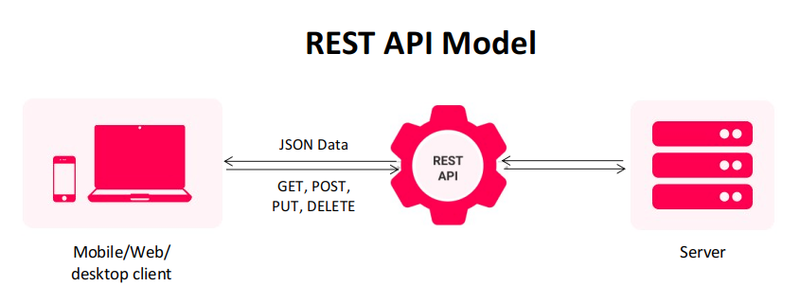
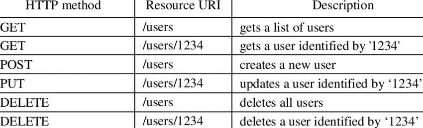
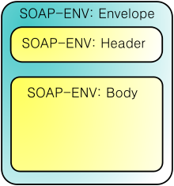
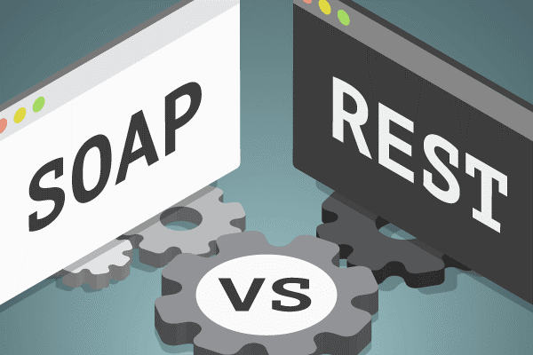
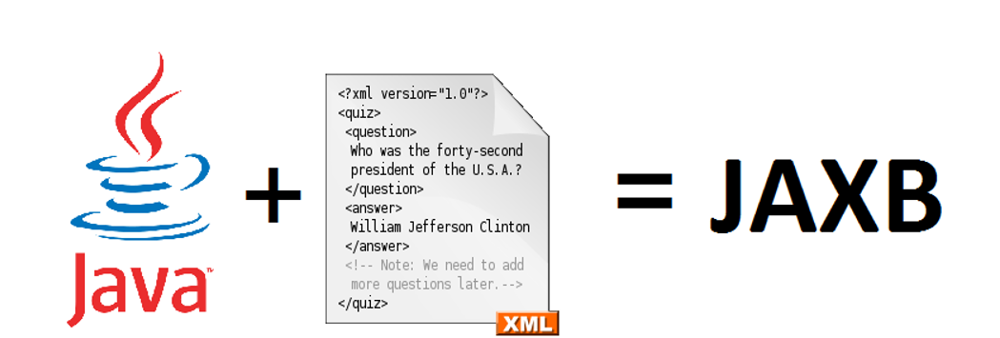

## REST (Representational State Transfer)nedir?




- REST, web servis oluşturmak için kullanılan web servis yöntemlerinden birisidir.

- REST programlama dilinden bağımsız olarak kullanılan bir yapıdır.

- REST, HTTP protokolüne ait HTTP yöntemlerini ve HTTP durum kodlarını kullanarak gelen isteklere XML, JSON, CSV vb. olarak cevap verir.

## HTTP Metotları

Aşağıdaki HTTP yöntemleri, yaygın olarak REST tabanlı mimaride kullanılır.

- GET – Veri(leri) almak için kullanılır.
- PUT – Veri(ler) üzerinde değişiklik yapmak için kullanılır.
- DELETE – Veri(leri) silmek için kullanılır.
- POST – Veri göndermek/eklemek için kullanılır.

<p>


</p>

REST API ile hazırlanmış web servislerinde çıktı biçimi olarak genellikle JSON kullanılır.

- REST(Representational State Transfer), dağıtık sistemler tasarlamak için kullanılan bir mimari tarzdır.
- REST ,servis yönelimli mimari üzerine oluşturulan yazılımlarda kullanılan bir transfer yöntemidir.
- İstemci ve sunucu arasında XML ve JSON verilerini taşıyarak uygulamanın haberleşmesini sağlar.REST mimarisini kullanan servislere ise RESTful servis denir.

## SOAP Nedir?

* SOAP (Basit Nesne Erişim Protokolü) dağıtık uygulamalarda ve web servislerinin haberleşmesinde kullanılmak üzere tasarlanan, RPC (Remote Procedure Call) modelini kullanan, istemci/sunucu mantığına dayalı bir protokoldür.RPC protokolü, istemciler ve sunucular arasındaki iletişimi istemci makineden gelen çağrıyı isteğe dönüştürerek yapar.
* SOAP, web üzerinden fonksiyonları kullanmak için geliştirilmiş bir sistemin XML tabanlı kurallar topluluğudur. SOAP ile ilgili bütün mesajlar XML formatında iletilir ve temel olarak bir SOAP mesajı 3 şekilde oluşabilir:
  - Metot Çağırımı
  - Cevap Mesajı
  - Hata Mesajı
  
## Bir SOAP mesajının yapısı
### Envelope
- Bütün SOAP mesajlarının içinde olduğu elemandır. SOAP mesajına ilişkin XML belgesinin root elemanı olmak zorundadır. Envelope elemanı içinde Body veya Header gibi elemanlar bulunur. SOAP mimarisine göre eğer Envelope elemanı içinde Header elemanı varsa bu eleman Envelope elemanının içindeki ilk eleman olmalıdır. 
### Header
- Header bölümü metot çağrımı ile doğrudan ilişkili değildir. Header bölümü ile meta-data dediğimizi bilgiler gönderilir.
### Body
- Body elemanı SOAP mesajının en önemli kısmını oluşturur. Body bölümünde web metodunun adı ve metodun parametrik bilgileri XML formatında gönderilir. Cevap mesajında ise metodun geri dönüş değeri Body bölgesine eklenir. 




```
<?xml version="1.0"?>
<soap:Envelope
xmlns:soap="http://www.w3.org/2003/05/soap-envelope/"
soap:encodingStyle="http://www.w3.org/2003/05/soap-encoding">
<soap:Header>
...
</soap:Header>
<soap:Body>
...
  <soap:Fault>
  ...
  </soap:Fault>
</soap:Body>
</soap:Envelope>
```

# REST vs SOAP



- SOAP XML veri tipini desteklerken REST istenen veri türüyle işlem yapabilir. JSON veri tipi ile XML’den çok daha düşük boyutlarla veri tutulabildiği için REST ile daha hızlı işlem yapılabilir.

- SOAP için WSDL ile tanımlama yapmak gerekirken REST için böyle bir zorunluluk yoktur.Bir dile ihtiyaç duymadan HTTP metodlarıyla tasarlanabildiği için REST’i kullanması ve tasarlaması daha kolaydır.
   
-	SOAP için birçok geliştirme aracı mevcuttur, REST için geliştirme araçlarına ihtiyaç duyulmaz.
-	SOAP; XML-Scheme kullanırken REST; URI-Scheme kullanır yani metotlar için URI’ler tanımlanır.	
- Her ikisi de HTTP protokolünü kullanırlar. Fakat REST için HTTP zorunluluğu varken SOAP; TCP, SMTP gibi başka protokollerle de çalışabilir. REST yaklaşımı HTTP metotlarını kullanarak işlerini görür. GET,POST,PUT,DELETE vs.
-REST basit HTTP GET metodunu kullandığı için Cache leme işlemi daha kolaydır. SOAP ile Cache leme yapabilmek için karmaşık XML requestleri yapılmalıdır.
- İkisi de HTTPS destekler, SOAP için WS-SECURITY adlı bir eklenti mevcuttur.
- SOAP, REST’den daha fazla bant genişliği ve kaynak gerektirir.
	
-	Uygulama Hızı: Uygulamanızın daha hızlı çalışmasını istiyorsanız REST kullanmanız yararınıza olacaktır.

-	SOAP:
   
```
   <?xml version="1.0"?> 
<SOAP-ENV:Zarf 
xmlns:SOAP-ENV 
="http://www.w3.org/2001/12/soap-envelope" 
SOAP-ENV:encodingStyle 
=" http: //www.w3.org/2001/12/soap-encoding"> 
<soap:Body> 
 <Demo.guru99WebService 
 xmlns="http://tempuri.org/"> 
   <EmployeeID>int</EmployeeID> 
   </Demo .guru99WebService> 
 </soap:Body> 
</SOAP-ENV:Zarf>

```
  - REST(JSON)
   
   ```
   {"şehir":"Mumbai","eyalet":"Maharastra"}
   ```

# GRPC Nedir? Neden REST'in Rakibi Olarak Gösterilmektedir?

gRPC Google'ın geliştirdiği açık kaynaklı bir veri değişim teknolojisidir. Soap gibi rpc kullanılmaktadır. İletişim protobuf dosyaları tanımlanarak ve bu dosyalardan auto-generate edilen kodlar ile iki taraf arasında katı bir şekilde (strictly) mutabakat sağlanmış bir şekilde HTTP 2 kullanılarak yapılmaktadır. HTTP1.1 de gönderim için mesajlar birbirini bekler paralel gönderim yapılmaz, bu da latency oluşmasına neden olur. 2. versiyonda ise aynı connection üzerinden paralel gönderim yapılabilir, bu sayede gereksiz bir latency yükünden kurtulunmuş olunur. gRPC, REST gibi unary iletişime de olanak sağladığı gibi server-streaming, client-streaming ve bi-directional streaminge de olanak sağlamaktadır. Protobuf kullanılarak protoc ile birden farklı programlama dilleri için gerekli boilerplate kodlar otomatik olarak generate edilebilmektedir. Server ile Client arasında aynı programlama dili olması zorunluluğu yoktur bu durumu ile SOAP ve REST'e benzemektedir.

## Örnek proto dosyası:

```
syntax = "proto3";

package unary_example;

message Greeting {
  string first_name = 1;
  string last_name = 2;
}

message GreetRequest {
  Greeting greeting = 1;
}

message GreetResponse {
  string result = 1;
}

service GreetService {
  rpc Greet(GreetRequest) returns (GreetResponse); 
  // server streaming: returns (stream GreetResponse)
  // client streaming: Greet(stream GreetRequest)
  // bi-di streaming: Greet(stream GreetRequest) returns (stream GreetResponse) 
}
```

## GRPC vs REST

- Rest için genellikle JSON/XML serialize/deserialize işlemlerine ihtiyaç duyulmakta ve bu işlemler yapılırken hatalar oluşabilmekte aynı zamanda da sisteme bir yük bindirilmek durumunda kalınmaktadır. gRPC mesajları anlamlı bir hale getirirken protobuf dosyasını kullanır.

- Rest için gelen giden mesaj yapısında iletişimin human-readable kalmasını sağlamak adına fazladan alanlar kullanılır, bu da mesaj boyutunu artırmaktadır (Aynı mesaj grpcde 5 katı daha az byte ile gönderilebilmektedir). gRPC de ise protobuf dosyası üzerinden iletişim sağlanır, human-readable değildir, gelen giden mesaj formatı binary formdadır ve debug etmesi REST'e göre zor olmaktadır ama binary format serialization/deserialization işlemlerinin çok kısa sürede tamamlanmasını da sağlamaktadır.

- Rest katı bir mutabakat anlatışı belirlemediği için haberleşmede farklı format kaynaklı problemler yaşanabilmektedir, diğer yandan gRPC çok katı bir şekilde mutabakatlı bir haberleşme altyapısı ile iletişimi sağlamaktadır. 


# JAXB Nedir?

  JAXB(Java Architecture for XML Binding), Java POJO sınıflarından XML çıktısı oluşturan, XML dosyalarındaki veriyi ise Java POJO sınıflarını üretip doğrudan onlara eşleyerek(binding) kullanabilmemize olanak sağlayan bir teknolojidir.

## JAXB Anotasyonları
### 1.@XmlRootElement
@XmlRootElement anotasyonu POJO sınıfının XML’e dönüştürülürken kullanılacak XML root tag’ini belirler. 

```	
import javax.xml.bind.annotation.XmlRootElement;
/*
*  İsim opsiyoneldir. Yazılırsa root tag olarak yazılan değeri alır.
*  (employee). Yazılmazsa sınıf ismi root tag'i olur.
*/
@XmlRootElement(name = "employee") 
public class Employee {
private int id;
//....
}
```
### 2. @XmlAccessorType
@XmlAccessorType anotasyonu Java sınıflarımızın, JAXB’nin binding işlemi için kullandığı alanları ve özelliklerini tanımlar. 4 farklı değer alır, bunlar; PUBLIC_MEMBER, FIELD, PROPERTY, NONE.
```
import javax.xml.bind.annotation.XmlAccessorType;
@XmlRootElement(name = "employee")
@XmlAccessorType(XmlAccessType.FIELD)
public class Employee {
private int id;
//....
}
	
```
### 3. @XmlAccessorOrder
 @XmlAccessorOrder anotasyonu ise bir sınıftaki alanların ve özelliklerin sırasını kontrol eder. 2 değer alır; ALPHABETICAL, UNDEFINED.

```
import javax.xml.bind.annotation.XmlAccessorOrder;
import javax.xml.bind.annotation.XmlAccessOrder;
@XmlRootElement(name = "employee")
@XmlAccessorType(XmlAccessType.FIELD)
@XmlAccessorOrder(XmlAccessOrder.ALPHABETICAL)
public class Employee {
//...
}
```
	
### 4. @XmlType
@XmlType anotasyonu, Java sınıfını veya enum tipini bir şema tipine eşler. Adını, ad alanını ve etiket sırasını tanımlar. Şemadaki ögeyi modeldeki ögeyle eşleştirmek için kullanılır.
```
import javax.xml.bind.annotation.XmlType;
@XmlRootElement(name = "employee")
@XmlAccessorType(XmlAccessType.FIELD)
@XmlAccessorOrder(XmlAccessOrder.ALPHABETICAL)
@XmlType(propOrder = {“id”, “name”, “surname”, “department”})
public class Employee {
private int id;
//...
}
```

### 5. @XmlElement
@XmlElement, POJO sınıfımızdaki bir alanı, XML’e eşlerken “name” değerine atanan değeri XML etiketi olarak kullanır. (Örneğin; “id” alanının eşi XML’de “employeeId” olacaktır.)
```
import javax.xml.bind.annotation.XmlElement;
@XmlRootElement(name = "employee")
@XmlAccessorType(XmlAccessType.FIELD)
@XmlAccessorOrder(XmlAccessOrder.ALPHABETICAL)
@XmlType(propOrder = {“id”, “name”, “surname”, “department”})
public class Employee {
@XmlElement(name = “employeeId”)
private int id;
}
```
	
## Marshalling (Java -> XML)
	
- Marshall işlemi için POJO sınıfından bir nesne üretip parametreleri yazılır.
- İşlem sonucu oluşacak dosya için bir konum belirlenir.
- JAXBContext sınfından, POJO sınıfını kullanarak jaxbContext üretilir.
- jaxbContext’i kullanarak marshaller objesi üretilir.
- Marshaller sınıfındaki static bir özellik olan JAXB_FORMATTED_OUTPUT alanına “true” değer vererek çıktının XML formatına uygun yazılması sağlanır. Aksi takdirde düz yazı şeklinde çıktı alınır.
marshall() metoduna POJO sınıfının nesnesini ve dosya yolu parametresini vererek çıktıyı alırız.
```
private static void marshall() {
		
	Employee employee = new Employee(1,"Halil İbrahim","MUKTAR", new Department(111, "Java Core", "Jr.Java Developer", "Sovos Foriba"));

	File output = new File("src/employee.xml");
	try {
		JAXBContext jaxbContext = JAXBContext.newInstance(Employee.class);
		Marshaller marshaller = jaxbContext.createMarshaller();
		marshaller.setProperty(Marshaller.JAXB_FORMATTED_OUTPUT, true);
		marshaller.marshal(employee, output);

	}catch(JAXBException e) {
		e.printStackTrace();
	}
}
```
## Unmarshalling (XML -> Java)

- Eşleyeceğimiz sınıfın objesi üretilir.
- Dosyayı nereden okuyacağı belirtilir.
- Yine JAXBContext objesi üretilir.
- jaxbContext’i kullanarak Unmarshaller sınıfından nesne üretilir.
- Dosya unmarshaller metoduna parametre olarak girilir, dönen sonuç POJO sınıfına çevirilip doğrudan POJO sınıfının objesine atanır.

```
public static void unMarshall() {
		
	Employee employeeObject = null;
	File file = new File("src/employee.xml");

	try {
		JAXBContext jaxbContext = JAXBContext.newInstance(Employee.class);
		Unmarshaller unmarshaller = jaxbContext.createUnmarshaller();
		employeeObject = (Employee) unmarshaller.unmarshal(file);

	}catch(JAXBException e) {
		e.printStackTrace();
	}

    System.out.println(employeeObject);
}
```

